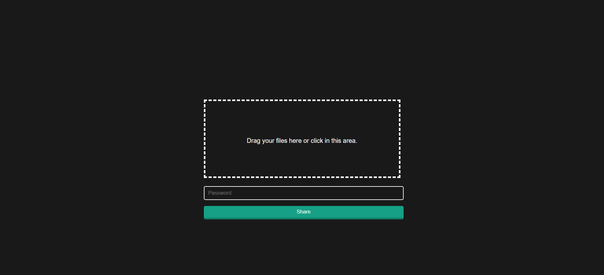
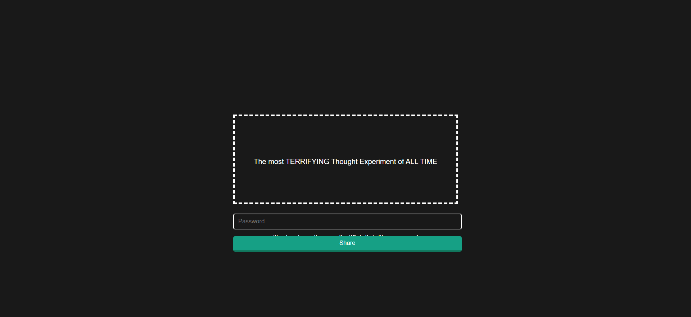
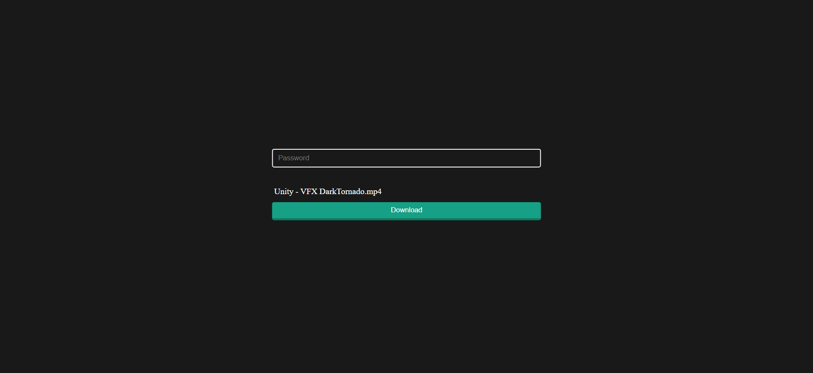
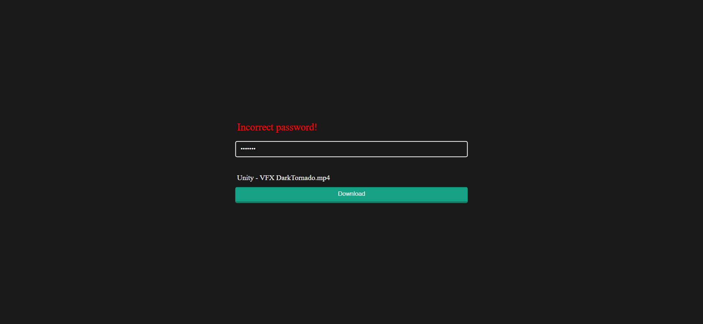
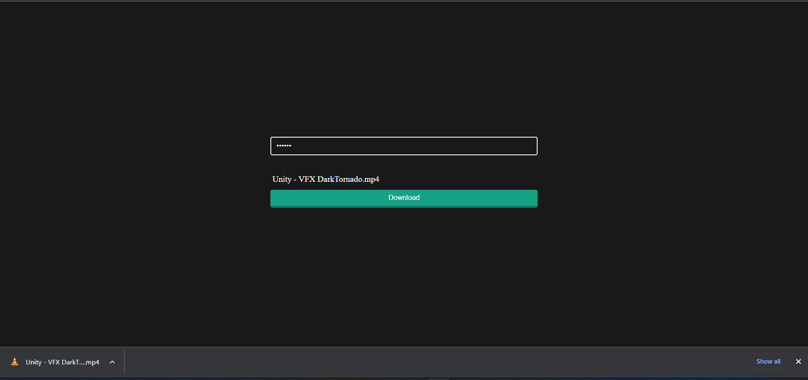

# File Share

File Share as the name suggest a file sharing MERN stack web apps with limit to share one file at a time with no more than 30mb file size. File can be access by the id after uploading a file it will show you a link and if you copy the link next time you can access the file by using the link. If you gave a password during the upload then you will need to provide the password to download the file or you wont be able to download the file.

<p align="center">
  
  
  
  
  
</p>

## Technologies Used

### FrontEnd

- Axios
- React-Router-Dom
- Vite

### BackEnd

- bcrypt
- body-parser
- cors
- dotenv
- express
- mongoose
- multer

### How to run

### Server

```properties
cd .\server\
npm i
npm run dev
```

### Client

```properties
cd .\client\
npm i
npm run dev
```
