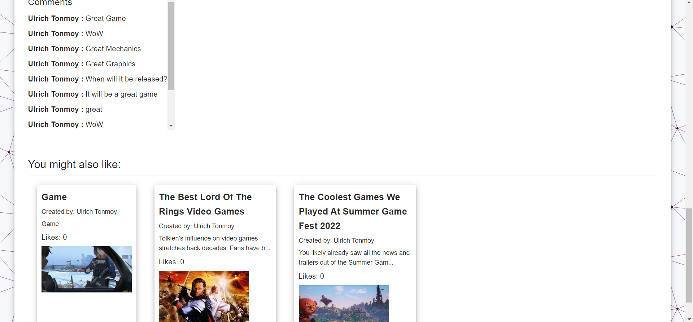
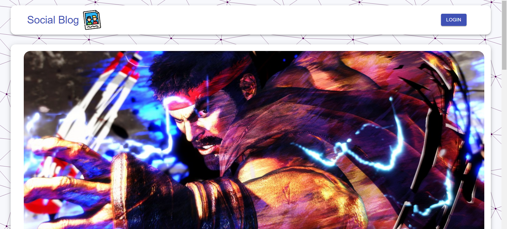

# social-blog

MERN Blog posting website with Email and Google Authentication. User can see the blog posts without authentication but cant like or comment on them. User can also search posts by title, tag or by both. The homepage has pagination and there is 9 post per page and its maintained in the backend so frontend only gets the data of 9 posts for that specific page and it doesn't make the page slow or heavy like loading all the posts and the using pagination. A authorize user can create edit and delete his posts and like, comment on any posts. when you visit a posts details page at the end of the page you will get recommendations based on the tags of the post you are reading.

<p align="center">
  
  
  
</p>

### How to run

### Server

```properties
cd .\server\
npm i
npm run dev
```

### Client

```properties
cd .\client\
npm i
npm start
```
