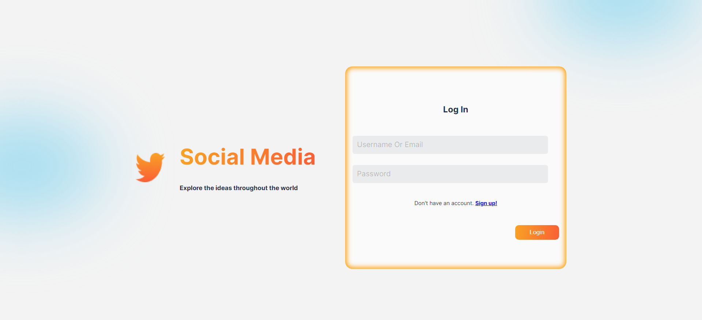
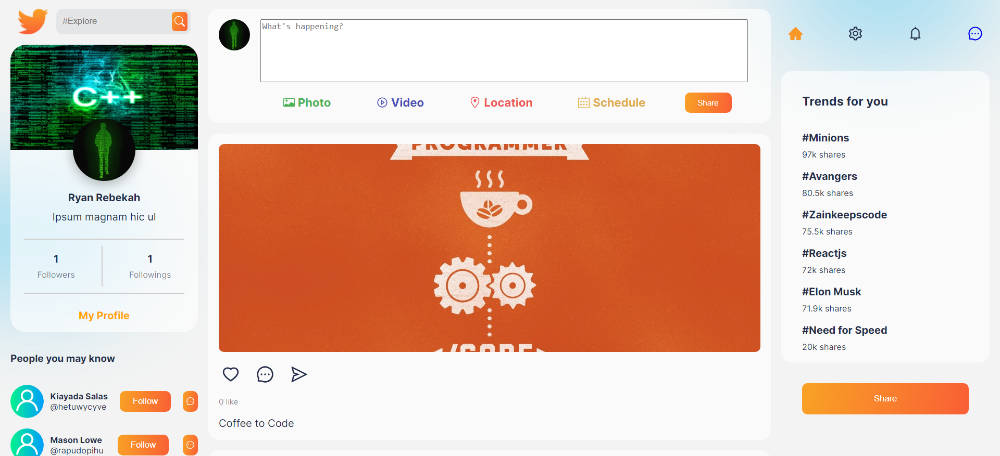
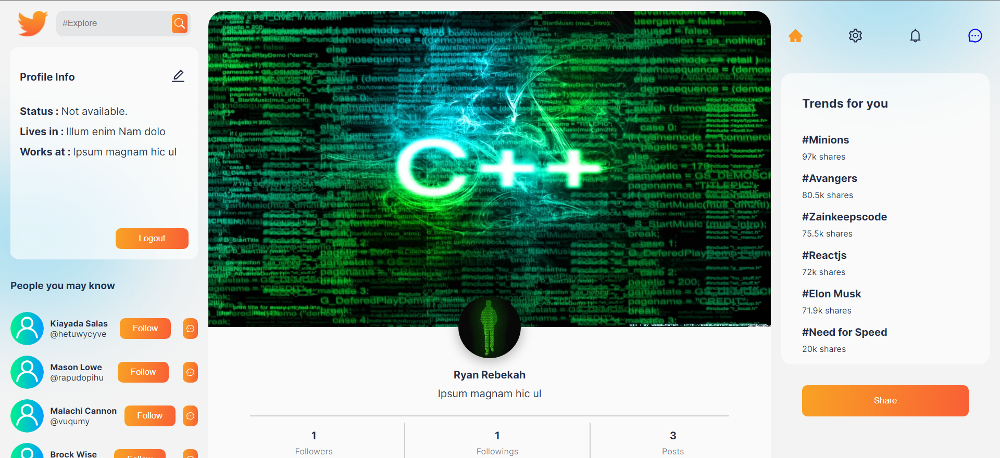
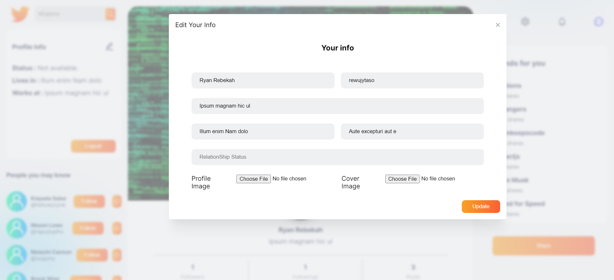
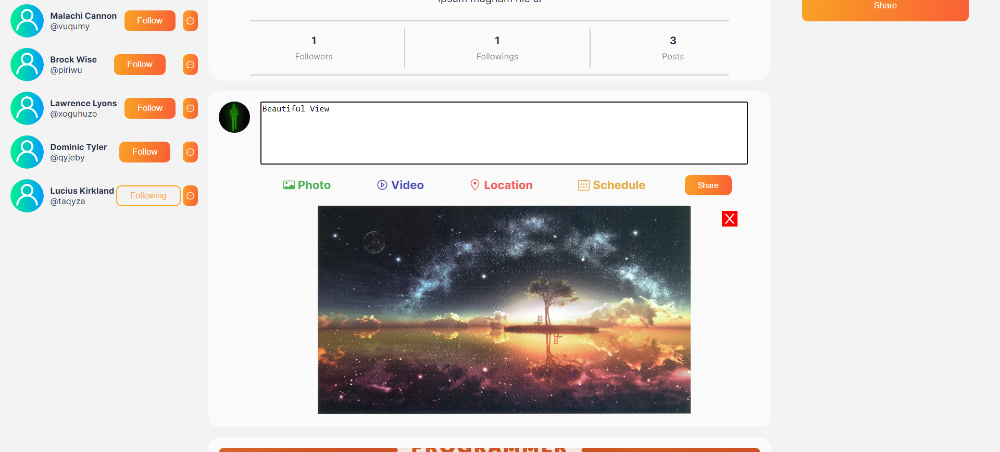
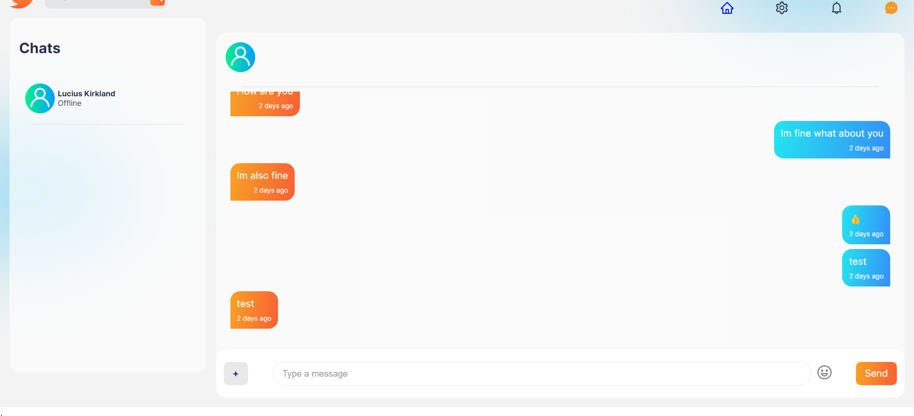

# social-media

MERN Social Media website with Email. User can follow other user create a post like a post and update profile and can sent message to other users.

<p align="center">
  
  
  
  
  
  
</p>

### How to run

### Server

```properties
<!-- First create a .env file and add the env variable as shown in .env.example then -->

cd .\server\
npm i
npm run dev
```

### Client

```properties
cd .\client\
npm i
npm start
```
